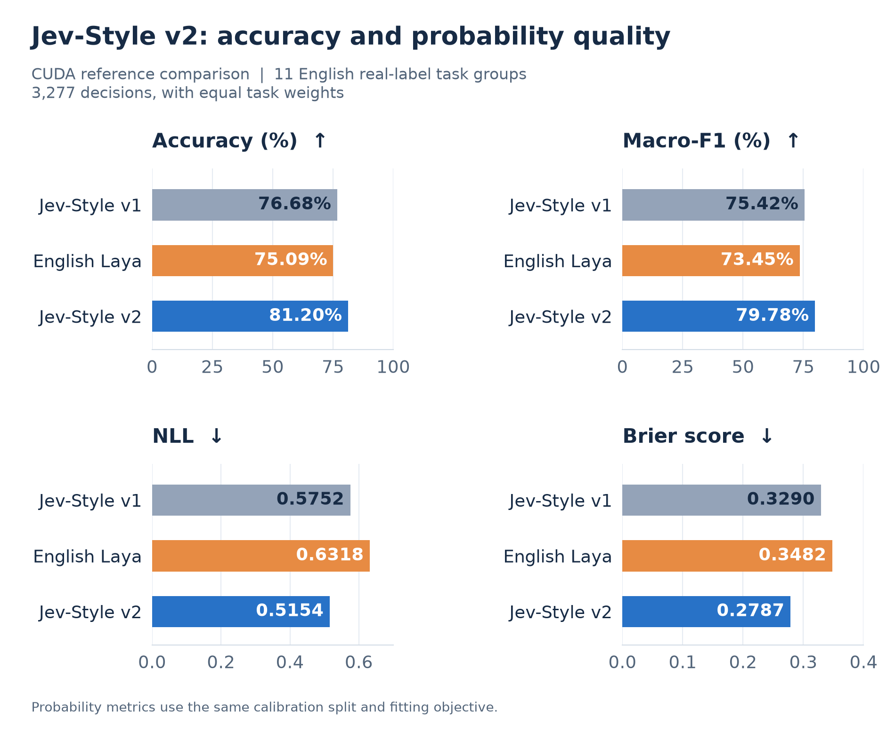
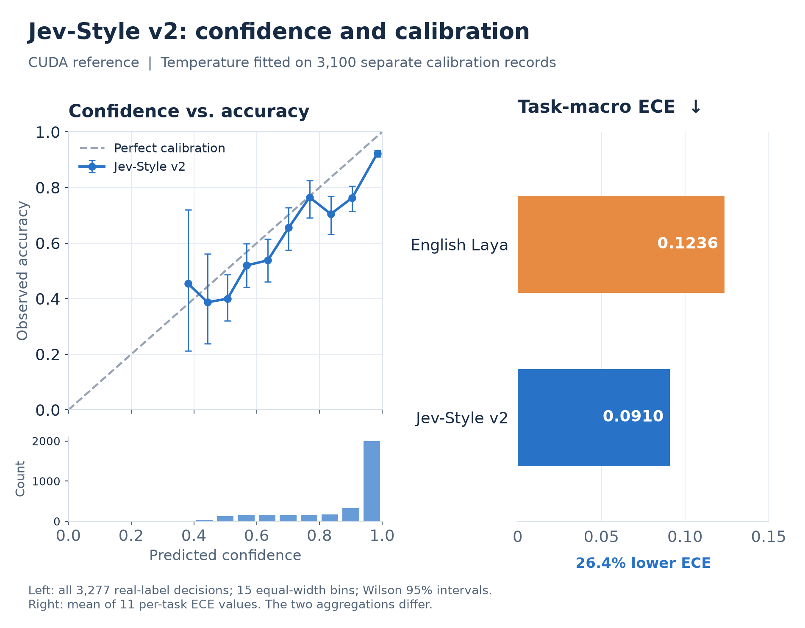
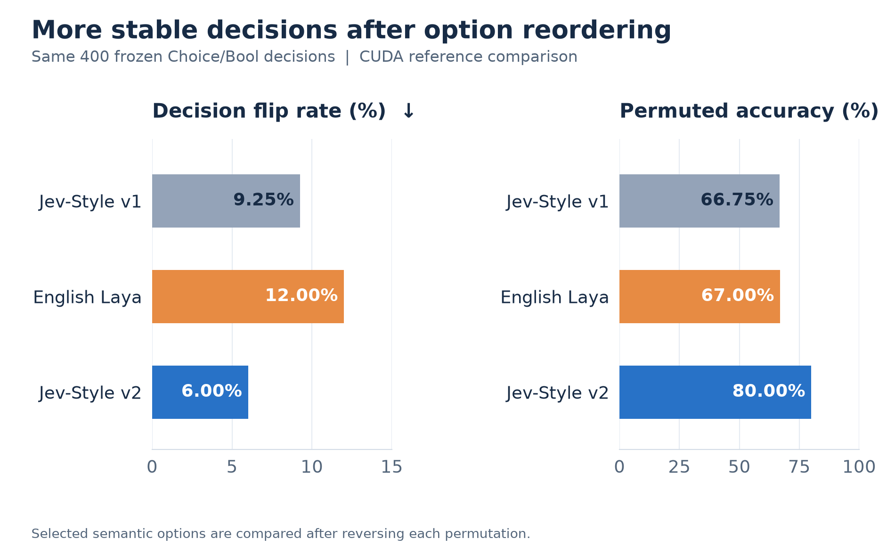

# Jev-Style-Qwen3.5-2B-Decision v2 (GGUF)

**Website:** [jevstyle.com](https://jevstyle.com/#v2) — all JevStyle decision models, benchmarks and quickstart in one place.

A **Jev-style decision model** for classification, routing and typed choices. Give it a state, a question and a list of options; one prefill returns a selected option **with calibrated probabilities**.

| Build | Weight size | Inference |
|---|---:|---|
| [HF BF16](https://huggingface.co/chaoliangUNSW/Jev-Style-Qwen3.5-2B-Decision-v2) | 3.76 GB | Transformers + decision client |
| **GGUF · this repository** | 1.27–3.78 GB | Q4_K_M / Q8_0 / BF16 · llama.cpp |
| [MLX BF16](https://huggingface.co/chaoliangUNSW/Jev-Style-Qwen3.5-2B-Decision-v2-MLX-bf16) | 3.76 GB | Apple Silicon + native MLX client |

**Choose a precision:**

| Precision | File size | Choice agreement | Macro accuracy |
|---|---:|---:|---:|
| [Q4_K_M](https://huggingface.co/chaoliangUNSW/Jev-Style-Qwen3.5-2B-Decision-v2-GGUF/resolve/main/Jev-Style-v2-Calibrated-Q4_K_M.gguf?download=true) | 1.27 GB | 91.4% | 78.18% |
| [Q8_0](https://huggingface.co/chaoliangUNSW/Jev-Style-Qwen3.5-2B-Decision-v2-GGUF/resolve/main/Jev-Style-v2-Calibrated-Q8_0.gguf?download=true) | 2.01 GB | 99.2% | 78.69% |
| [BF16](https://huggingface.co/chaoliangUNSW/Jev-Style-Qwen3.5-2B-Decision-v2-GGUF/resolve/main/Jev-Style-v2-Calibrated-BF16.gguf?download=true) | 3.78 GB | 99.6% | 79.36% |

All three files include independently fitted calibration; use **runtime temperature 1.0**. Agreement is against CUDA merged BF16 on the same frozen 500-decision subset; accuracy is the task-macro average over its real-label examples. [Full precision comparison](evaluation/quantization_summary.json).


## Results

**81.20% macro accuracy on the fixed English reference panel**, compared with 76.68% for v1 and 75.09% for English Laya. The results below use the CUDA reference structure: 11 real-label task groups, 3,277 decisions, equal task weights, and the same 3,100-record calibration split. Results for the released deployment formats appear further below.

| Metric | Jev-Style v1 | English Laya | **Jev-Style v2** |
|---|---:|---:|---:|
| Accuracy ↑ | 76.68% | 75.09% | **81.20%** |
| Macro-F1 ↑ | 75.42% | 73.45% | **79.78%** |
| Negative log-likelihood ↓ | 0.5752 | 0.6318 | **0.5154** |
| Brier score ↓ | 0.3290 | 0.3482 | **0.2787** |



- **Higher accuracy:** +4.53 percentage points over v1 and +6.12 over English Laya; paired 95% intervals are [+3.58, +5.52] and [+4.64, +7.52] points, respectively, within this fixed panel.
- **Broader task coverage:** accuracy point estimates ahead of English Laya in **9 of 12 task groups**, including the separately scored teacher-reference typed-decisions group.
- **Better probability quality against English Laya:** **18.4% lower NLL**, **20.0% lower Brier score**, and **26.4% lower task-macro ECE**.
- **Efficient adaptation:** **36.9 minutes of main training on one H100 80GB**, using rank-32 LoRA on a 2B-class text backbone.

## Calibration

The reliability diagram plots the v2 model's stated confidence against observed correctness. Every real-label evaluation decision is included; the histogram shows how many predictions fall in each confidence bin. Error bars show Wilson 95% intervals. The accompanying ECE comparison averages per-task calibration errors.



Temperature is fitted on the calibration split. HF and MLX clients apply the supplied calibration automatically; the calibrated GGUF file incorporates it in the final normalization tensor.

## Robustness

**Option-order flip rate is halved relative to English Laya**, with **80.00% accuracy after permutation** on the same 400 Choice/Bool decisions. Semantic options are mapped back to their original identities before scoring.

| Option-permutation test | Jev-Style v1 | English Laya | **Jev-Style v2** |
|---|---:|---:|---:|
| Decision flip rate ↓ | 9.25% | 12.00% | **6.00%** |
| Accuracy after permutation ↑ | 66.75% | 67.00% | **80.00%** |



On a separate **200-pair programmatic threshold-policy test**, both decisions in a counterfactual pair are correct in **71.50%** of pairs for v2, compared with 63.00% for v1. This test measures that specific rule family.

## Task-level results

<details>
<summary><strong>Per-task accuracy: all 11 real-label tasks and the separate typed-decision group</strong></summary>

| Real-label task | Examples | Jev-Style v1 | English Laya | Jev-Style v2 |
|---|---:|---:|---:|---:|
| AG News | 300 | 87.67% | 89.00% | 88.00% |
| ANLI | 300 | 48.00% | 49.67% | 48.67% |
| BoolQ | 300 | 82.67% | 75.67% | 81.67% |
| Emotion | 300 | 58.33% | 60.33% | 85.33% |
| Enron spam | 300 | 77.33% | 96.33% | 97.67% |
| HANS | 300 | 68.00% | 75.00% | 68.00% |
| IMDb | 300 | 96.67% | 93.67% | 96.33% |
| MNLI | 300 | 86.67% | 85.00% | 88.00% |
| RTE | 277 | 84.48% | 77.98% | 85.92% |
| SST-2 | 300 | 92.67% | 91.67% | 93.00% |
| SST-5 | 300 | 61.00% | 31.67% | 60.67% |

The separate typed-decisions group contains 2,000 teacher-reference decisions from 400 states. Teacher agreement is 53.35% for v1, 37.55% for English Laya and **73.45% for v2** under the fixed primary interface. This group is excluded from the real-label macro. The comparison here uses the English Laya checkpoint; specialist-checkpoint and rendering sensitivity results are provided in [baseline_sensitivity.json](evaluation/baseline_sensitivity.json).

</details>


## Deployment validation

GGUF is available in **Q4_K_M, Q8_0 and BF16**, each with its own calibration and verification record.

| Released format | Weight size | Validated result | Evaluation set |
|---|---:|---|---|
| HF BF16 | 3.76 GB | **81.27%** real-label macro accuracy | Full 3,277 real-label decisions |
| Native MLX BF16 | 3.76 GB | **99.6%** choice agreement with CUDA BF16 | Frozen 500-decision deployment subset |
| Calibrated GGUF Q8_0 | 2.01 GB | **99.2%** choice agreement with CUDA BF16 | Same 500-decision deployment subset |
| Calibrated GGUF Q4_K_M | 1.27 GB | **91.4%** choice agreement with CUDA BF16 | Same 500-decision deployment subset |
| Calibrated GGUF BF16 | 3.78 GB | **99.6%** choice agreement with CUDA BF16 | Same 500-decision deployment subset |

Each deployment format has its own validation record. Native MLX packaging reproduces the verified MLX client's logits exactly on all 500 deployment cases. The Q8_0 model is approximately **46.7% smaller** than the BF16 GGUF export.

On the same 500-case deployment subset, real-label task-macro accuracy is **79.10%** for CUDA BF16, **79.04%** for MLX BF16 and **78.69%** for Q8_0. Full-panel reference results and deployment-subset results use their respective denominators.

<details>
<summary><strong>Evaluation data and downloadable vector charts</strong></summary>

- [Reference metrics and paired intervals](evaluation/reference_comparison.json)
- [Deployment validation](evaluation/deployment.json)
- [Baseline sensitivity results](evaluation/baseline_sensitivity.json)
- [Data sources and split manifest](evaluation/data_manifest.json)
- [Chart data, confidence bins and sample counts](evaluation/chart_data.json)
- Vector charts: [benchmark](figures/benchmark.svg), [calibration](figures/calibration.svg), [robustness](figures/robustness.svg)

The benchmark figures describe the fixed CUDA reference comparison. Reliability pools all real-label examples into confidence bins; task-macro ECE is the mean of 11 separate task ECE values. These are distinct aggregations. The 9/12 figure counts task-level point estimates. Individual prediction probabilities, task summaries, test protocols and calibration records were retained when drawing these charts.

</details>

## Quick start

```bash
python -m pip install -U huggingface_hub
hf download chaoliangUNSW/Jev-Style-Qwen3.5-2B-Decision-v2-GGUF --local-dir jev-v2-gguf
cd jev-v2-gguf
llama-server -m Jev-Style-v2-Calibrated-Q8_0.gguf -c 2048 -ngl 99 --port 8080
```

In another terminal, from the same directory:

```bash
python jev_decision_client.py --url http://127.0.0.1:8080 \
  --state "The film was excellent." \
  --question "What is the sentiment of this review?" \
  --options negative positive
```

The quick-start command selects Q8_0. To use Q4_K_M or BF16, replace its model filename with `Jev-Style-v2-Calibrated-Q4_K_M.gguf` or `Jev-Style-v2-Calibrated-BF16.gguf`.

Use a llama.cpp build with Qwen3.5 support. Conversion and native evaluation used commit `b29c606e28a01b1bc8c1351026a0fa6e616bf6c4`. The client uses the native `/completion` endpoint, requests complete declared-option log-probabilities and increases the candidate count as needed. The supplied `gguf_logits.cpp` reads all declared-option logits directly through the C API.

**Runtime calibration temperature is 1.0** for this file: its fitted temperature has already been incorporated. The accompanying calibration JSON records the exact settings and checksum. Serve the raw decision prompt shown below, with the full declared option list.

### Ollama

```bash
ollama run hf.co/chaoliangUNSW/Jev-Style-Qwen3.5-2B-Decision-v2-GGUF:Q4_K_M
```

Send the raw decision prompt shown below as the message; the model replies with the letter of the selected option (` B` for the example). Replace `Q4_K_M` with `Q8_0` or `BF16` for another precision. This repository supplies its own Ollama template, so run `ollama pull` again if you pulled the model before 2026-09-25.


## Decision interface

Provide an English state, a question, and **2–26 unique options**, within a **1,024-token prompt**. A single prefill produces one logit per declared option. Apply the supplied calibration once and normalize over those options to obtain the decision probabilities.

```text
You are a decision function. Read the state, then answer the question by choosing exactly one option.

[State]
The film was excellent.

[Question]
What is the sentiment of this review?

[Options]
A. negative
B. positive

Answer:
```

The supplied clients implement this exact prompt and read the next-position ` A` through ` Z` token scores. Use this decision interface for Choice, Bool and ordered Score tasks; `decide_bool` returns the probability of yes, and `decide_score` also returns the expected zero-based level. For ordered scores, supply options from lowest to highest.

## Training

Continued from the uncalibrated Jev-Style v1 text backbone derived from [Qwen3.5-2B-Base](https://huggingface.co/Qwen/Qwen3.5-2B-Base). Training used a BF16 backbone, FP32 rank-32 LoRA (alpha 32), 186 adapted modules and 33,638,400 trainable parameters. Effective batch size was 64 with a 1,024-token budget.

The 60,000-record training pool combines original-task replay with emotion, email, typed workflow decisions, label transformations and programmatic threshold rules. A two-stage schedule increases hard-example sampling while retaining approximately 50% original-task replay. Main training completed 1,000 optimizer updates and processed 11,605,632 tokens in 36.9 minutes on one H100 80GB.

Development (2,050 records), calibration (3,100 records) and final evaluation (5,277 decisions) were handled separately. Checkpoint selection used development results; calibration used the calibration split. This release records one training seed. The evaluation JSON files document the dataset, rendering and deployment protocols.

## License and attribution

Apache-2.0. See [LICENSE](LICENSE). This release builds on Qwen3.5-2B-Base and Jev-Style v1. Training data retain their original source licenses; source and split details are recorded in the data manifest. The release contains model artifacts and aggregate evaluation records.

## Contact

I welcome internship, employment, and research collaboration opportunities. Please contact me at [**yanchaoliang369@gmail.com**](mailto:yanchaoliang369@gmail.com).

欢迎提供实习、工作及科研合作机会，请邮件联系：[yanchaoliang369@gmail.com](mailto:yanchaoliang369@gmail.com)。
